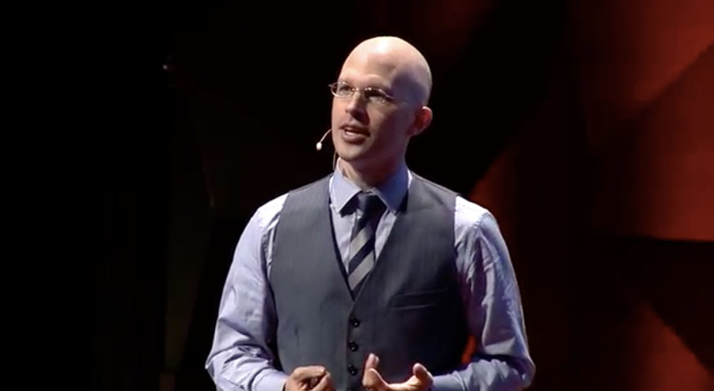
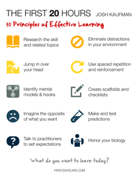
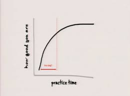
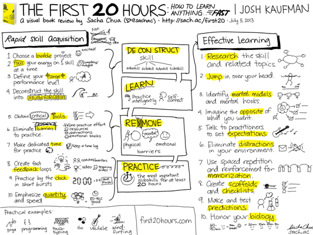

# 20 hours Learning Video

Josh Kaufaman talks about how 20 hours learning is a mindset and is required to actually get good at something as compared to the 10000 hours mindset which is required to master a skill or become an expert in it.

  - Change in mindset
  - Removing the emotional barriers
  - Focus and dedication for 20 hours.

### The initial 20 hours are what make or break a skill of a person . 

#### Answer to fact that whether we will have time to learn new things. If you are the one who is curious for stuff and want to learn them up to a good level this is one of the methodology

##### Ultra competetive people require those 10 thousand hours to get on the top of thier field. As the learning curve can be seen below . Within the initial some hours you can learn things good enough to get over the emotional barrier and become reasonably good in it.

### Steps to learn something

- [ ] Deconstruct the skill.
- [ ] Practice Intelligently.
- [ ] Remove Practice Barriers. 
- [ ] Practice at least 20 hours.
- [ ] 20 Hours Gets You Over the Frustration Barrier. 
- [ ] Learn Enough to Self-Correct.
- [ ] Open a pull request

###### The actual book written by Josh Kaufaman

